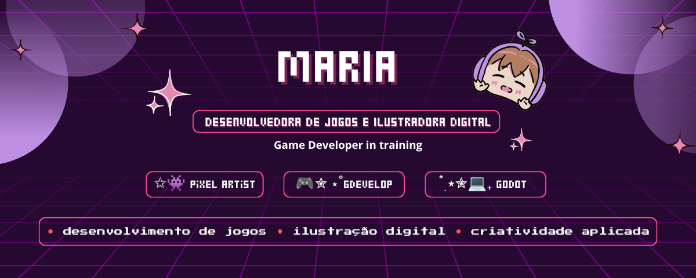

  

## 🪐 Sobre mim

👾 Desenvolvedora de jogos em formação, apaixonada por programação, game design e arte digital. Além de criar mecânicas e sistemas para jogos, ilustrações digitais e artes em pixelArt. Atualmente desenvolvo projetos utilizando GDevelop, unindo criatividade, aprendizado constante e desenvolvimento de experiências interativas.

Atualmente estou concluindo a graduação em Design de Animação, aprofundando meus conhecimentos em narrativa visual, ilustração, animação e processos criativos para mídias digitais.

## 📖 Studying

- Game Dev
- Programação em Jogos
- Animação em Pixel Art
- Game Design

## 🛠️ Tools

## 🫟 Art Software

## 🎮 Engines

## 💻 Programming Languages

## 📫 Contato

